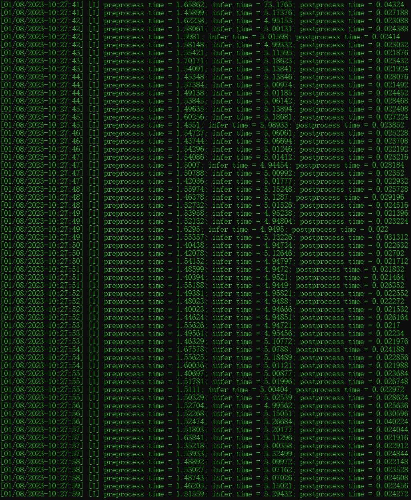

# yolov8

## Introduce
全网最先实现yolov8模型部署（基于tensorrt + cuda），模型前处理、infer、后处理全部在GPU上完成。

## 源码
https://github.com/FeiYull/tensorrt-alpha

## 运行截图

some precision alignment renderings comparison: 

			<!--块级封装-->
     
	<!--将图片和文字居中-->
    
     		<!--换行-->
    
yolov8n : Offical( left ) vs Ours( right )	<!--标题-->

     		<!--换行-->
     		<!--换行-->
    
	<!--将图片和文字居中-->
    
     		<!--换行-->
    
支持yolov8前处理、后处理、推理在GPU上运行<!--标题-->

     		<!--换行-->
     		<!--换行-->
    

## Reference
[0].https://github.com/FeiYull/tensorrt-alpha 
